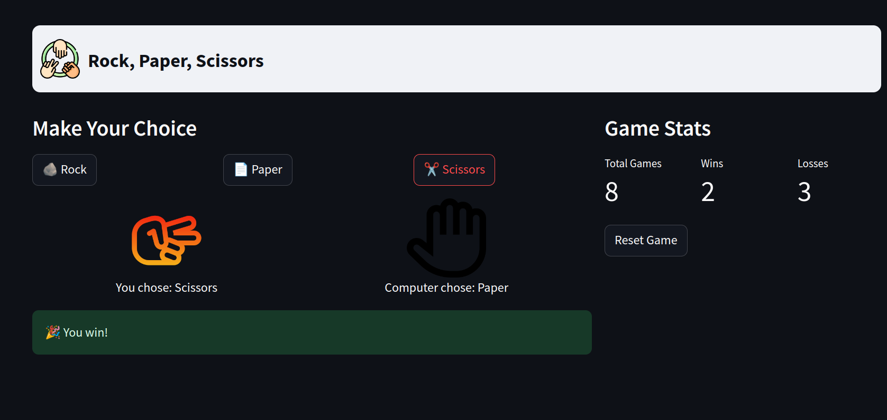

# Rock, Paper, Scissors Game

## Overview

This is a simple Rock, Paper, Scissors game built using Streamlit. Players can select their choice and play against the computer, which randomly selects its choice. The game keeps track of wins, losses, and total games played. 




## Features

- User-friendly interface
- Real-time score tracking
- Responsive design
- Image representation of choices

## Requirements

- Python 3.7 or higher
- Streamlit
- Pillow

## Installation

1. **Clone the repository:**

```bash
   git clone https://github.com/MahtabRanjbar/rock_paper_scissor_app.git
   cd rock_paper_scissor_app
```

2. Install the required packages

```bash 
    pip install -r requirements.txt
```
3. Running the App
 To run the application, execute the following command:

```bash
    streamlit run app.py
```
## How to Play
- Select your choice (Rock, Paper, or Scissors) from the dropdown menu.
- Click the "Play" button to see the results.
- Your score will be updated after each round.

## Contributing
Feel free to submit issues or pull requests if you want to contribute to the project.

## License
This project is open-source and available under the MIT License.
